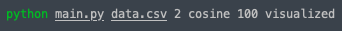
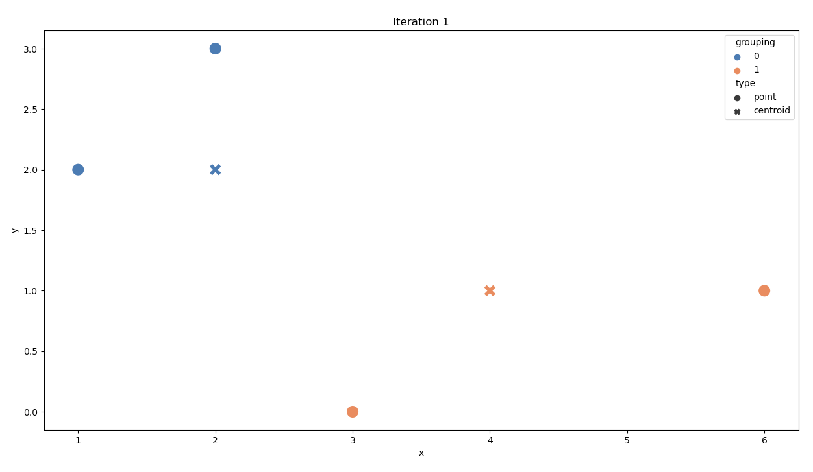
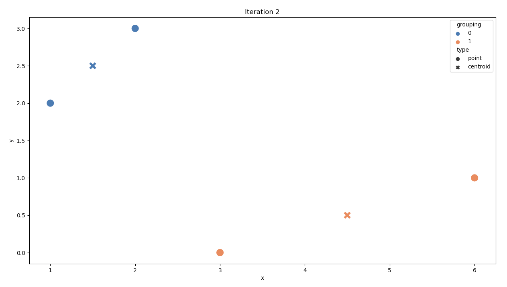
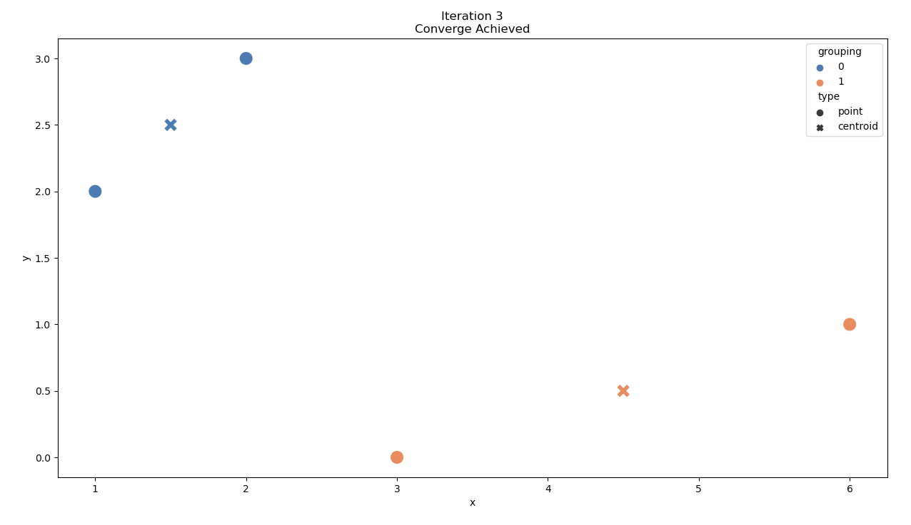

<h1> K-Means Process </h1>

    <h2>What?</h2>
    <ol>
        <li>Help visualized the Process of K-Means by Iteration</li>
    <ol>

 

    <h2>How?</h2>
    <ol>
        <li>Save data in <samp>.csv</samp></li>
        <li>Run the <samp>main.py</samp> and pass [file] [n-centroid] [euclidean/manhattan/cosine] [max-iteration] optional[visualized] as the arguments.</li>
        
    <ol>

 

    <h2>Sample Result</h2>
    
    
    

